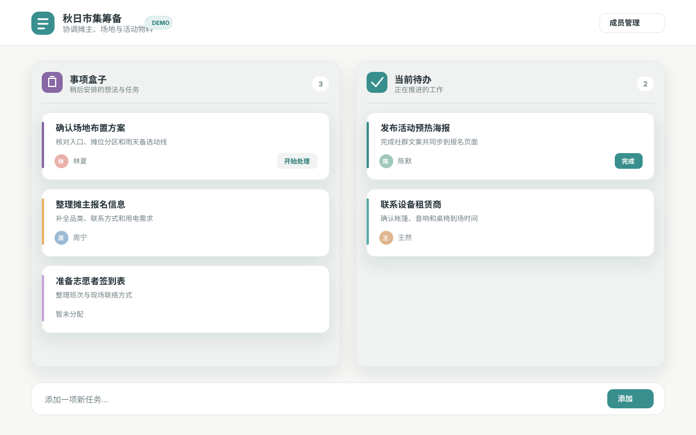

# Online Cowork

一个适合小团队的轻量协作看板。管理员创建项目并分享专属链接，协作者无需注册，打开链接即可一起维护任务。

适合临时项目、活动筹备和小型团队协作，不需要为每位参与者创建账号。



## 能做什么

- 通过专属链接邀请协作者，无需注册或登录。
- 使用「事项盒子 → 当前待办 → 已完成」推进工作。
- 快速添加、编辑、排序、移动和分配任务。
- 管理项目成员、项目名称和说明。
- 由管理员统一创建项目、重置访问链接或删除项目。
- 数据持久保存在 PostgreSQL 中，并通过版本校验减少协作时的修改覆盖。

## 先体验一下

仓库提供了一个无需安装、无需数据库的交互式成员看板 Demo：

👉 [打开 Online Cowork 交互式 Demo](demo/online-cowork-demo.html)

下载仓库后，直接用浏览器打开 `demo/online-cowork-demo.html` 即可体验添加任务、拖拽排序、分配成员和完成任务。Demo 数据只保存在当前浏览器中，不会上传服务器，也不包含管理员后台和多人协作。

## 谁如何使用

- **管理员**：登录管理后台，创建项目并把访问链接发给协作者。
- **协作者**：打开项目链接，直接管理该项目内的成员和任务，无需登录。

第一次使用完整应用时，可以按下面的流程快速体验：

1. 管理员登录并创建一个项目。
2. 复制项目访问链接，在另一个浏览器窗口中打开它。
3. 添加成员和任务，将任务从「事项盒子」推进到「当前待办」，完成后移入「已完成」。

## Docker 快速试用

适合在本机或可信内网运行完整应用，包含 Online Cowork 和 PostgreSQL。

### 前置条件

- Git
- Docker 与 Docker Compose

### 启动

```bash
git clone <YOUR_REPOSITORY_URL>
cd online-cowork-app
cp .env.production.example .env.production
sh scripts/quickstart-production.sh
```

启动完成后，打开 [http://127.0.0.1:3000/login](http://127.0.0.1:3000/login)：

- 试用账号：`trial@example.com`
- 试用密码：`try-cowork-2026`

如需确认服务状态，可以执行：

```bash
curl -fsS http://127.0.0.1:3000/api/health/ready
```

> 默认账号、密码和密钥仅供本机或可信内网试用。对外开放或保存真实数据前，请按照 `.env.production.example` 的注释替换全部试用配置。

数据保存在 Docker 的 `postgres_data` 卷中，正常更新或重启不会删除数据。不要执行 `docker compose -f docker-compose.prod.yml down -v`，其中 `-v` 会删除数据库卷。

## 部署方式

- **快速部署**：App 与 PostgreSQL 部署在同一台机器，直接使用上面的 Docker 快速试用流程。
- **分离部署**：数据库需要独立维护时，请阅读 [分离部署指南](docs/separate-deployment.md)。

网络入口、域名、反向代理和 HTTPS 由实际部署环境负责。正式环境应使用唯一的数据库密码、管理员密码、`SESSION_SECRET` 和 `PROJECT_TOKEN_PEPPER`，并且不要提交 `.env.production` 或 `.env.local`。

## 开发与相关文档

- [本地开发指南](docs/local-development.md)：安装依赖、配置数据库、运行测试。
- [分离部署指南](docs/separate-deployment.md)：独立维护 App 与 PostgreSQL。
- [远程 PostgreSQL 开发指南](docs/remote-postgres-deployment.md)：在远程 Linux 服务器运行开发数据库。

## 技术栈

Next.js 16、React 19、TypeScript、Drizzle ORM、PostgreSQL、Docker Compose。
